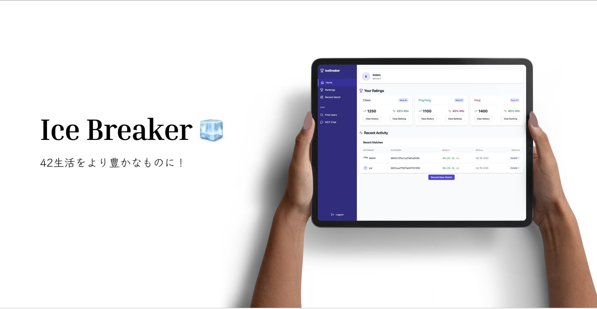
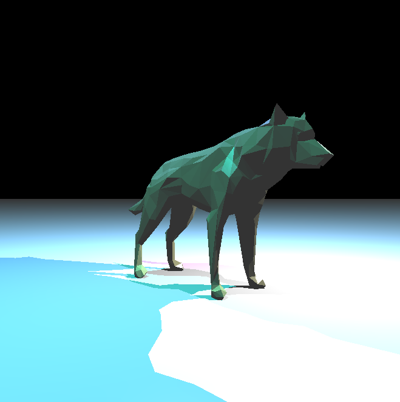
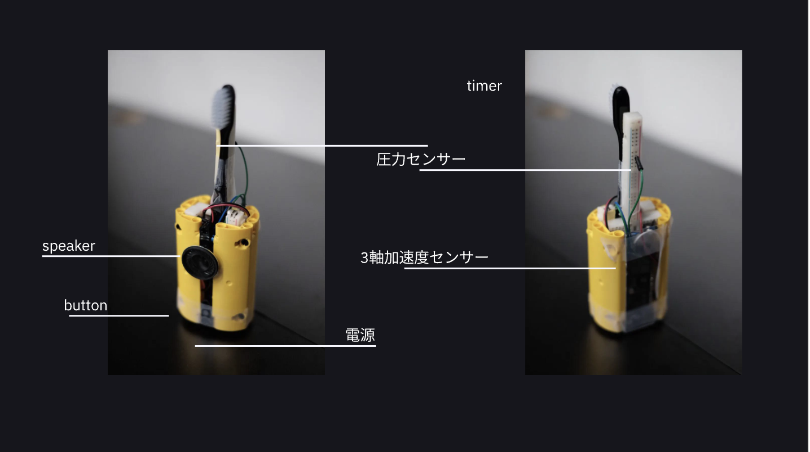
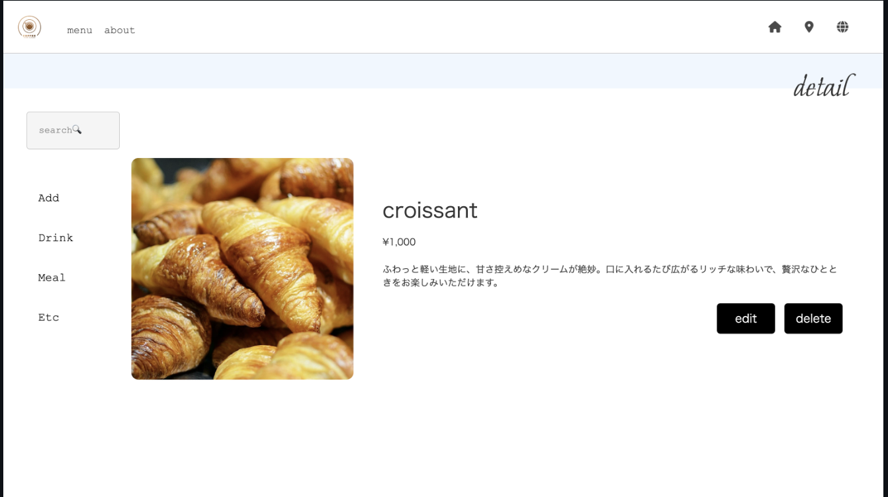
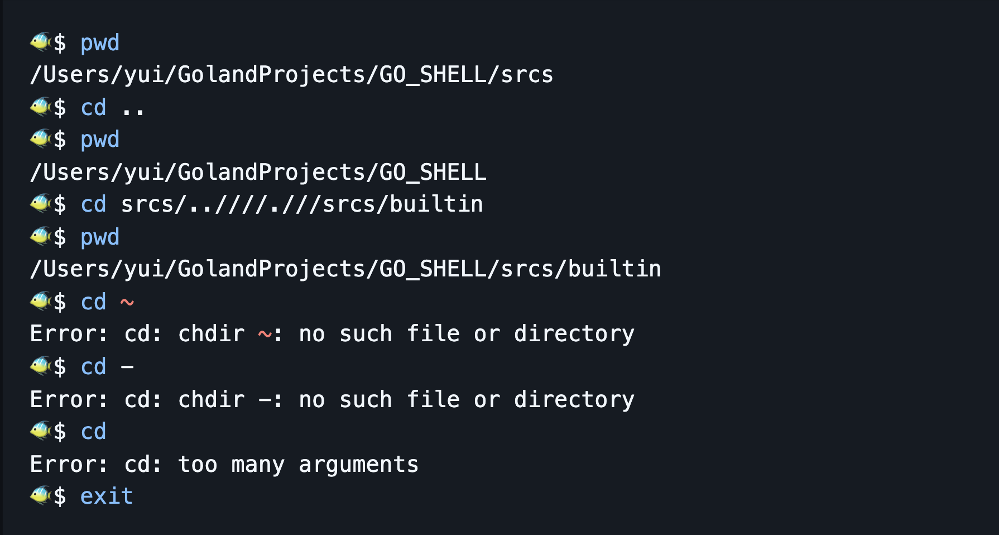

## WORKS🍋

| Project     | Created At | Duration | Preview                                                        | Link                                                                       | Frame                                                                                   | Description                                                            |
| ----------- | ---------- | -------- | -------------------------------------------------------------- | -------------------------------------------------------------------------- | --------------------------------------------------------------------------------------- | ---------------------------------------------------------------------- |
| IceBreaker  | 2025-04    | 2 days   |     | [PDF](https://github.com/QWERTOP18/SLIDES/blob/main/IceBreaker.pdf)        |  | function calling                                                       |
| RayTrace    | 2024-04    | a month  |            | [GitHub](https://github.com/QWERTOP18/MINIRT)                              |                               | Ray tracing engine built from scratch in C with no external libraries. |
| Hibi        | 2024-03    | 1 week   |          | [PDF](https://github.com/QWERTOP18/SLIDES/blob/main/Hibi.pdf)              |                  |                                                                        |
| TeethJocker | 2024-03    | 3 days   |  | [PDF](https://github.com/QWERTOP18/SLIDES/blob/main/TeethJocker.pdf)       |                        | ESP32                                                                  |
| Cafe lp     | 2024-03    | 1 week   |          | [GitHub](https://github.com/QWERTOP18s/RAILS_DEMO_CAFE_LP)                 |                  |
| GO Shell    | 2024-02    | a month  |        | [Books](https://github.com/QWERTOP18/ZENN/tree/main/books/go-shell-202502) |                         |                                                                        |

## Activities⛹️‍♀️

 <a href="https://monkeytype.com/profile/qwertop18">
   
 </a>

<!--START_SECTION:waka-->


**I'm a Night 🦉** 

```text
🌞 Morning                356 commits         ██░░░░░░░░░░░░░░░░░░░░░░░   09.39 % 
🌆 Daytime                1155 commits        ████████░░░░░░░░░░░░░░░░░   30.45 % 
🌃 Evening                1065 commits        ███████░░░░░░░░░░░░░░░░░░   28.08 % 
🌙 Night                  1217 commits        ████████░░░░░░░░░░░░░░░░░   32.09 % 
```


📊 **This Week I Spent My Time On** 

```text
🕑︎ Time Zone: Asia/Tokyo

💬 Programming Languages: 
Python                   8 hrs 30 mins       ███████████░░░░░░░░░░░░░░   42.46 % 
C++                      6 hrs 30 mins       ████████░░░░░░░░░░░░░░░░░   32.50 % 
Bash                     1 hr 30 mins        ██░░░░░░░░░░░░░░░░░░░░░░░   07.56 % 
TypeScript               1 hr 15 mins        ██░░░░░░░░░░░░░░░░░░░░░░░   06.24 % 
Makefile                 35 mins             █░░░░░░░░░░░░░░░░░░░░░░░░   02.96 % 

🔥 Editors: 
VS Code                  14 hrs 13 mins      ██████████████████░░░░░░░   70.95 % 
Cursor                   5 hrs 7 mins        ██████░░░░░░░░░░░░░░░░░░░   25.58 % 
Neovim                   32 mins             █░░░░░░░░░░░░░░░░░░░░░░░░   02.69 % 
Zed                      9 mins              ░░░░░░░░░░░░░░░░░░░░░░░░░   00.78 % 

💻 Operating System: 
Mac                      14 hrs 54 mins      ███████████████████░░░░░░   74.34 % 
Linux                    5 hrs 8 mins        ██████░░░░░░░░░░░░░░░░░░░   25.66 % 
```

**Timeline**


 Last Updated on 23/04/2025 17:41:48 UTC
<!--END_SECTION:waka-->
