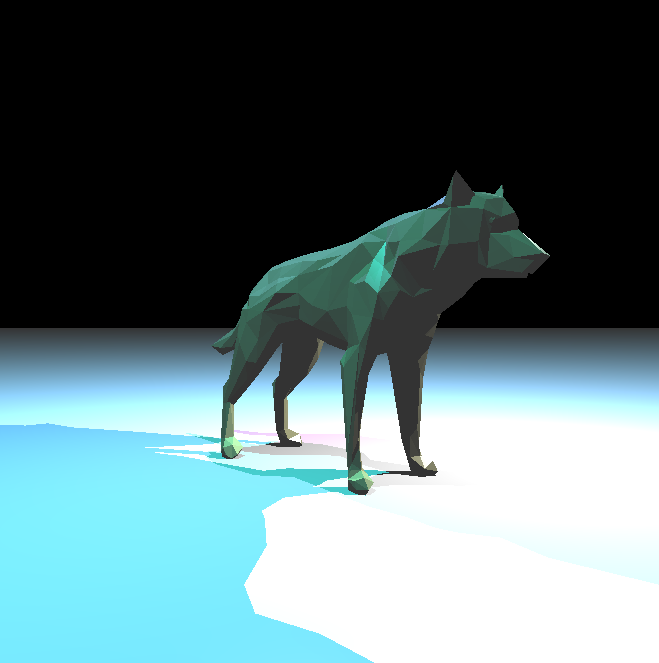

## ☕️ Works

| created_at | Project     | Preview                                                  | Link                                                                              | frame                                                                   |        | description                                                |
| ---------- | ----------- | -------------------------------------------------------- | --------------------------------------------------------------------------------- | ----------------------------------------------------------------------- | ------ | ---------------------------------------------------------- |
| 2024-04    | RayTrace    |      | [GitHub](https://github.com/QWERTOP18/MINIRT)                                     |               |        | A ray tracing renderer fully implemented from scratch in C |
| 2024-03    | Hibi        |    | [PDF](https://github.com/QWERTOP18/SLIDES/blob/main/Light%20slides.pdf)           |  | OpenAI |                                                            |
| 2024-03    | TeethJocker |  | [PDF](https://github.com/QWERTOP18/SLIDES/blob/main/Teeth%20Jocker.pdf)           |        | ESP32  |                                                            |
| 2024-03    | Cafe lp     |    | [GitHub](https://github.com/QWERTOP18s/RAILS_DEMO_CAFE_LP/tree/master/.md/assets) |  |        |                                                            |
| 2024-02    | GO SHELL    |  | [Book](https://github.com/QWERTOP18/ZENN/tree/main/books/go-shell-202502)         |         |        | GO で実装する shell script WIP👷                           |

## 🏃‍♀️ Activities

<!--START_SECTION:waka-->


**🐱 My GitHub Data** 

> 📦 81.3 kB Used in GitHub's Storage 
 > 
> 🏆 990 Contributions in the Year 2025
 > 
> 🚫 Not Opted to Hire
 > 
> 📜 31 Public Repositories 
 > 
> 🔑 70 Private Repositories 
 > 
**I'm a Night 🦉** 

```text
🌞 Morning                319 commits         ██░░░░░░░░░░░░░░░░░░░░░░░   08.91 % 
🌆 Daytime                1063 commits        ███████░░░░░░░░░░░░░░░░░░   29.70 % 
🌃 Evening                1014 commits        ███████░░░░░░░░░░░░░░░░░░   28.33 % 
🌙 Night                  1183 commits        ████████░░░░░░░░░░░░░░░░░   33.05 % 
```


📊 **This Week I Spent My Time On** 

```text
🕑︎ Time Zone: Asia/Tokyo

💬 Programming Languages: 
C                        14 hrs 13 mins      █████████░░░░░░░░░░░░░░░░   37.05 % 
C++                      10 hrs 41 mins      ███████░░░░░░░░░░░░░░░░░░   27.84 % 
Markdown                 6 hrs 25 mins       ████░░░░░░░░░░░░░░░░░░░░░   16.72 % 
Other                    3 hrs 41 mins       ██░░░░░░░░░░░░░░░░░░░░░░░   09.59 % 
Makefile                 1 hr 38 mins        █░░░░░░░░░░░░░░░░░░░░░░░░   04.27 % 

🔥 Editors: 
VS Code                  35 hrs 32 mins      ███████████████████████░░   92.52 % 
Zed                      1 hr 34 mins        █░░░░░░░░░░░░░░░░░░░░░░░░   04.09 % 
Neovim                   54 mins             █░░░░░░░░░░░░░░░░░░░░░░░░   02.37 % 
Cursor                   23 mins             ░░░░░░░░░░░░░░░░░░░░░░░░░   01.02 % 

💻 Operating System: 
Linux                    25 hrs 26 mins      █████████████████░░░░░░░░   66.21 % 
Mac                      12 hrs 58 mins      ████████░░░░░░░░░░░░░░░░░   33.79 % 
```

**Timeline**


 Last Updated on 17/04/2025 18:50:52 UTC
<!--END_SECTION:waka-->
