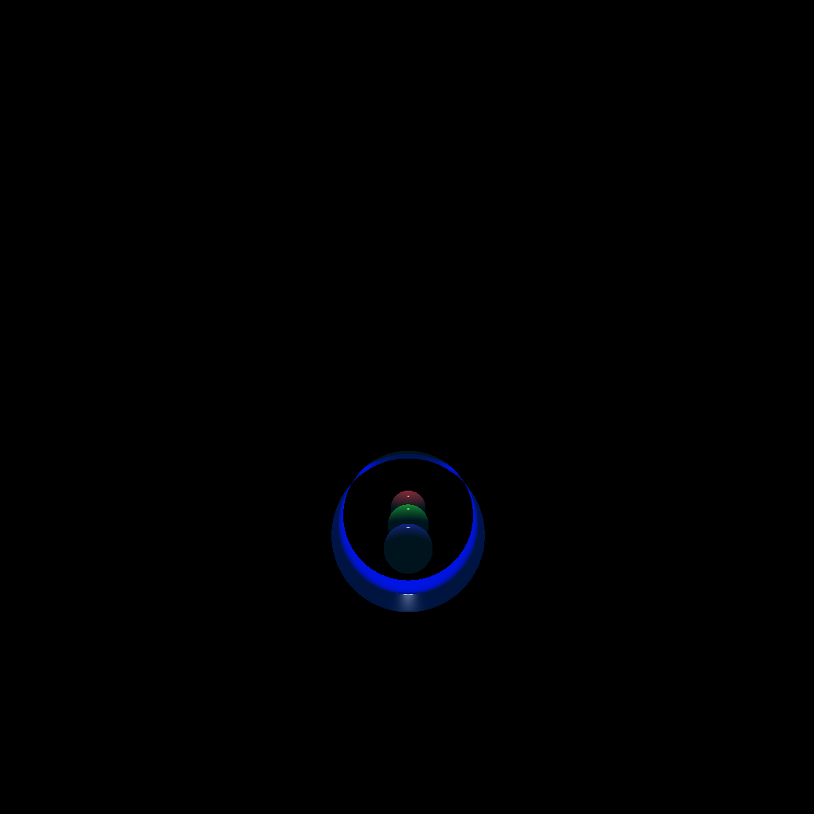
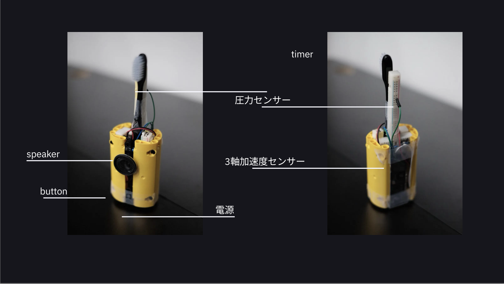
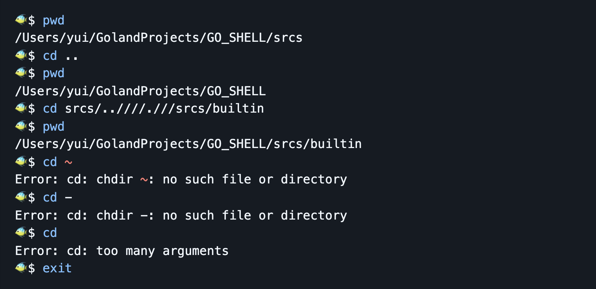

## ☕️ Works

| Project     | Preview                                                  | Link                                                                              | frame                                                             |        | description                                                |
| ----------- | -------------------------------------------------------- | --------------------------------------------------------------------------------- | ----------------------------------------------------------------- | ------ | ---------------------------------------------------------- |
| RayTrace    |      | [GitHub](https://github.com/QWERTOP18/MINIRT)                                     |         |        | A ray tracing renderer fully implemented from scratch in C |
| Hibi        |    | [PDF](https://github.com/QWERTOP18/SLIDES/blob/main/Light%20slides.pdf)           |  | OpenAI |                                                            |
| TeethJocker |  | [PDF](https://github.com/QWERTOP18/SLIDES/blob/main/Teeth%20Jocker.pdf)           |  | ESP32  |                                                            |
| Cafe lp     |    | [GitHub](https://github.com/QWERTOP18s/RAILS_DEMO_CAFE_LP/tree/master/.md/assets) |  |        |                                                            |
| GO SHELL    |  | [Book](https://github.com/QWERTOP18/ZENN/tree/main/books/go-shell-202502)         |   |        | GOで実装するshell script WIP👷                             |

## 🏃‍♀️ Activities

<!--START_SECTION:waka-->


**🐱 My GitHub Data** 

> 📦 77.8 kB Used in GitHub's Storage 
 > 
> 🏆 921 Contributions in the Year 2025
 > 
> 🚫 Not Opted to Hire
 > 
> 📜 30 Public Repositories 
 > 
> 🔑 64 Private Repositories 
 > 
**I'm a Night 🦉** 

```text
🌞 Morning                321 commits         ██░░░░░░░░░░░░░░░░░░░░░░░   09.00 % 
🌆 Daytime                1052 commits        ███████░░░░░░░░░░░░░░░░░░   29.50 % 
🌃 Evening                1021 commits        ███████░░░░░░░░░░░░░░░░░░   28.63 % 
🌙 Night                  1172 commits        ████████░░░░░░░░░░░░░░░░░   32.87 % 
```


📊 **This Week I Spent My Time On** 

```text
🕑︎ Time Zone: Asia/Tokyo

💬 Programming Languages: 
C                        16 hrs 38 mins      ████████████░░░░░░░░░░░░░   47.48 % 
C++                      9 hrs 45 mins       ███████░░░░░░░░░░░░░░░░░░   27.84 % 
Markdown                 4 hrs 14 mins       ███░░░░░░░░░░░░░░░░░░░░░░   12.10 % 
Makefile                 1 hr 37 mins        █░░░░░░░░░░░░░░░░░░░░░░░░   04.61 % 
Python                   51 mins             █░░░░░░░░░░░░░░░░░░░░░░░░   02.43 % 

🔥 Editors: 
VS Code                  34 hrs 39 mins      █████████████████████████   98.87 % 
Cursor                   23 mins             ░░░░░░░░░░░░░░░░░░░░░░░░░   01.13 % 

💻 Operating System: 
Linux                    27 hrs 38 mins      ████████████████████░░░░░   78.85 % 
Mac                      7 hrs 24 mins       █████░░░░░░░░░░░░░░░░░░░░   21.15 % 
```

**Timeline**


 Last Updated on 13/04/2025 18:47:21 UTC
<!--END_SECTION:waka-->
